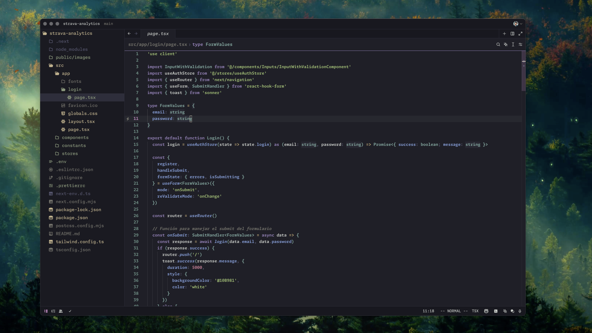
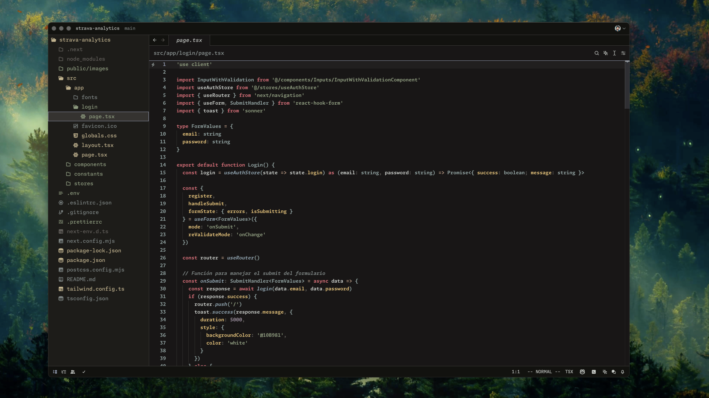
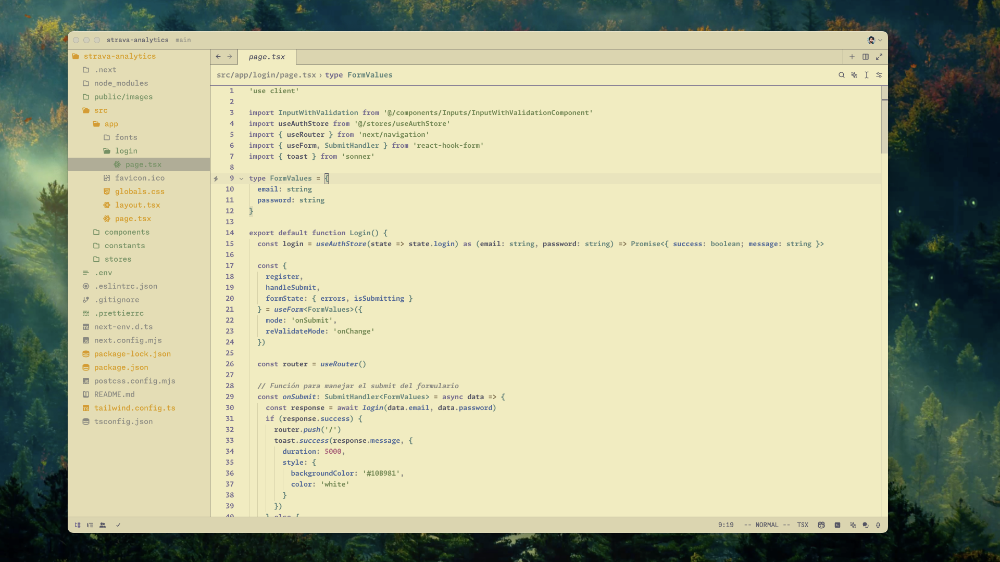

# Zed Kanagawa Theme

## Descripción

El **Zed Kanagawa Theme** es una colección de temas oscuros y claros inspirados en la estética japonesa y la naturaleza. Estos temas están diseñados para proporcionar una experiencia visual agradable y relajante mientras trabajas en tu editor de código.

## Temas Incluidos

- **Kanagawa**: Un tema oscuro con colores suaves y relajantes.

- **Kanagawa Dragon**: Una variante oscura con tonos más profundos y contrastantes.

- **Kanagawa Wave**: Un tema oscuro con un enfoque en tonos azules y verdes.

- **Kanagawa Lotus**: Un tema claro inspirado en la serenidad de los lotos.

## Uso

Para aplicar uno de los temas en tu editor de código, sigue las instrucciones específicas de tu editor para importar y activar temas personalizados. Asegúrate de seleccionar el archivo JSON correspondiente al tema que deseas utilizar.

## Licencia

Este proyecto está licenciado bajo la Licencia MIT. Consulta el archivo [LICENSE](LICENSE) para obtener más detalles.

## Agradecimientos

Este tema está inspirado en la belleza de la naturaleza japonesa y en la serenidad que proporciona. Agradecimientos especiales a todos los desarrolladores y diseñadores que contribuyen a crear experiencias visuales agradables en el mundo del desarrollo de software.

---
